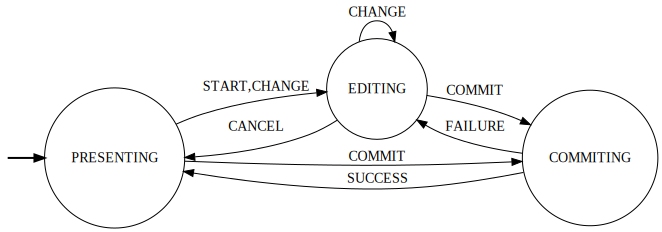

# React Editable [](https://travis-ci.org/dcwither/react-editable-decorator) [](https://coveralls.io/github/dcwither/react-editable-decorator?branch=master) [](https://david-dm.org/dcwither/react-editable-decorator)

A component that wraps around a form component to provide an editing state that it maintains. Works with promises returned by the Editable methods.

React Editable can accept anything as its value, making it a generic wrapper for any controlled component that needs a temporary editing state.

## Why Use It?

React Editable factors out the concerns of temporary state and whether to maintain it in a global store like Redux, or in your own component. It passes through its current state so you can render your component differently depending on whether it's inactive, editing, or waiting on a promise.

## Demo & Examples

Live demo: https://dcwither.github.io/react-editable-decorator/

```
npm install
npm start
```

Then open [`localhost:6006`](http://localhost:6006) in a browser

## Usage

```js
import PropTypes from 'prop-types';
import React from 'react';
import {
  withEditable
  Editable
  EditableStatus,
  EditableStatusType
} from "react-editable-decorator";

class Input extends React.Component {
  static propTypes = {
    onCommit: PropTypes.func.isRequired
    onChange: PropTypes.func.isRequired,
    status: EditableStatusType.isRequired,
    value: PropTypes.string.isRequired
  };

  handleCommit = () => {
    this.props.onCommit('SUBMIT');
  }

  handleChange = evt => {
    this.props.onChange(evt.target.value);
  };

  render() {
    const { status, value } = this.props;
    return (
      <div>
        <input
          className="input"
          disabled={status === EditableStatus.COMMITTING}
          onChange={this.handleChange}
          value={value}
        />
        <button onClick={this.handleCommit}>Submit</button>
      </div>
    );
  }
}

// Either wrap in the Editable Component with render props
<Editable onCommit={onCommit}>
  {({onChange, onCommit}) => {
    <Input onChange={onChange} onCommit={onCommit} />
  }}
</Editable>

// Or compose with the HOC
const EditableInput = withEditable(Input);
```

## State Transitions



## Properties

| Property   | Type                  | Required | Description                                                   |
| ---------- | --------------------- | -------- | ------------------------------------------------------------- |
| `onCancel` | func(value)           | No       | Callback for when editing is canceled                         |
| `onCommit` | func(message, value)  | No       | Callback for commit changes                                   |
| `value`    | child.propTypes.value | No       | Unedited value to be passed through to child while presenting |

## Child Properties

| Property   | Type                                     | Description                                                                                    |
| ---------- | ---------------------------------------- | ---------------------------------------------------------------------------------------------- |
| `onStart`  | func                                     | Callback that triggers start of editing                                                        |
| `onCancel` | func                                     | Callback that triggers cancel editing and clears edited value                                  |
| `onChange` | func(nextValue)                          | Callback that triggers change in edited value                                                  |
| `onCommit` | func(message)                            | Callback that triggers a commit                                                                |
| `status`   | 'PRESENTING', 'EDITING', or 'COMMITTING' | Current status of ReactEditable                                                                |
| `value`    | any                                      | The value passed into Editable if `PRESENTING` or the edited value if `EDITING` or `COMMITING` |

## Commit Event Handler (`onCommit`)

This will be called when the matching callback passed through to the render prop child is called. If it returns a promise, ReactEditable will remain in a `COMITTING` state until the promise resolves. If ReactEditable unmounts before the promise resolves, it will cancel its promise, and avoid a setState.
